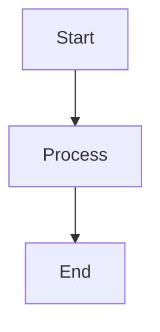
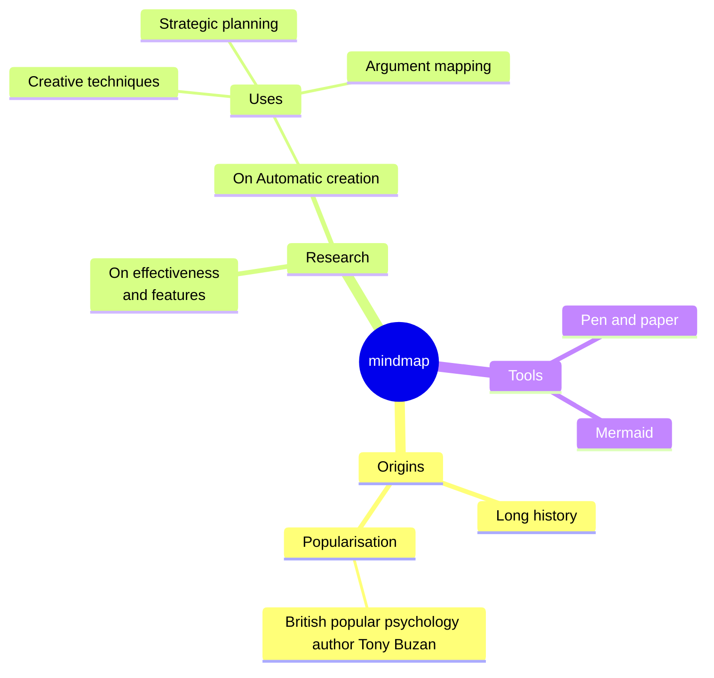
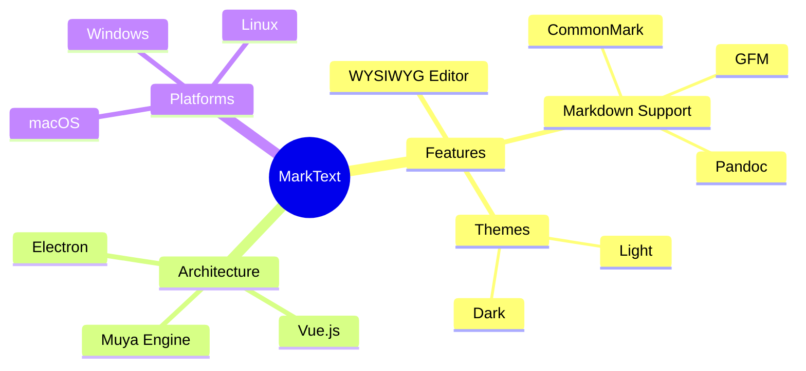

# Test Mermaid Mindmap

## Regular Mermaid Diagram (should work)

```mermaid
graph TD
    A[Start] --> B[Process]
    B --> C[End]
```

## Mindmap Diagram (testing)

```mermaid
mindmap
  root((mindmap))
    Origins
      Long history
      ::icon(fa fa-book)
      Popularisation
        British popular psychology author Tony Buzan
    Research
      On effectiveness<br/>and features
      On Automatic creation
        Uses
            Creative techniques
            Strategic planning
            Argument mapping
    Tools
      Pen and paper
      Mermaid
```

## Another Mindmap Example

```mermaid
mindmap
  root((MarkText))
    Features
      WYSIWYG Editor
      Markdown Support
        CommonMark
        GFM
        Pandoc
      Themes
        Light
        Dark
    Architecture
      Electron
      Vue.js
      Muya Engine
    Platforms
      macOS
      Windows
      Linux
```